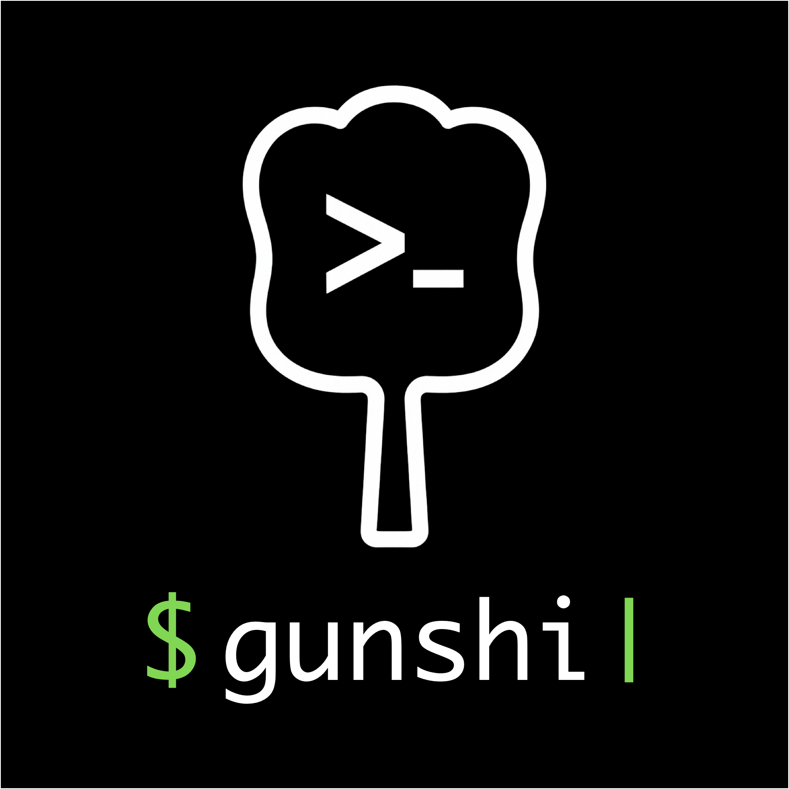

<p align="center">
	
</p>
<h1 align="center">🏯 Gunshi</h1>

[![Version][npm-version-src]][npm-version-href]
[![CI][ci-src]][ci-href]
[![InstallSize][install-size-src]][install-size-src]
[![JSR][jsr-src]][jsr-href]

Gunshi is a modern javascript command-line library

<!-- eslint-disable markdown/no-missing-label-refs -->

> [!TIP]
> gunshi (軍師) is a position in ancient Japanese samurai battle in which a samurai devised strategies and gave orders. That name is inspired by the word "command".

<!-- eslint-enable markdown/no-missing-label-refs -->

## ✨ Features

Gunshi is designed to simplify the creation of modern command-line interfaces:

- 📏 **Simple & Universal**: Run the commands with simple API and support universal runtime.
- ⚙️ **Declarative configuration**: Configure command modules declaratively for better organization and maintainability.
- 🛡️ **Type Safe**: TypeScript support with type-safe argument parsing and option resolution by [args-tokens](https://github.com/kazupon/args-tokens)
- 🧩 **Composable**: Create modular sub-commands that can be composed together for complex CLIs.
- ⏳ **Lazy & Async**: Load command modules lazily and execute them asynchronously for better performance.
- 📜 **Auto usage generation**: Generate helpful usage messages automatically for your commands.
- 🎨 **Custom usage generation**: Customize how usage messages are generated to match your CLI's style.
- 🌍 **Internationalization**: Support multiple languages with built-in i18n, locale resource lazy loading and i18n library integration.

## 💿 Installation

```sh
# npm
npm install --save gunshi

## pnpm
pnpm add gunshi

## yarn
yarn add gunshi

## deno
deno add jsr:@kazupon/gunshi

## bun
bun add gunshi
```

## 🚀 Usage

```js
import { cli } from 'gunshi'

// define a command with declarative configuration, using commandable object
const command = {
  name: 'greet',
  description: 'A greeting command',
  options: {
    name: {
      type: 'string',
      short: 'n',
      description: 'Name to greet'
    },
    greeting: {
      type: 'string',
      short: 'g',
      default: 'Hello',
      description: 'Greeting to use (default: "Hello")'
    },
    times: {
      type: 'number',
      short: 't',
      default: 1,
      description: 'Number of times to repeat the greeting (default: 1)'
    }
  },
  run: ctx => {
    const { name = 'World', greeting, times } = ctx.values
    for (let i = 0; i < times; i++) {
      console.log(`${greeting}, ${name}!`)
    }
  }
}

// run a command that is defined above
// (the 3rd argument of `cli` is the command option)
await cli(process.argv.slice(2), command, {
  name: 'my-app',
  version: '1.0.0',
  description: 'My CLI application'
})
```

About more details and usage, see [documentations](https://gunshi.dev)

## 💁‍♀️ Showcases

- [pnpmc](https://github.com/kazupon/pnpmc): PNPM Catalogs Tooling
- [sourcemap-publisher](https://github.com/es-tooling/sourcemap-publisher): A tool to publish sourcemaps externally and rewrite sourcemap URLs at pre-publish time
- [curxy](https://github.com/ryoppippi/curxy): An proxy worker for using ollama in cursor
- [SiteMCP](https://github.com/ryoppippi/sitemcp): Fetch an entire site and use it as an MCP Server

## 🙌 Contributing guidelines

If you are interested in contributing to `gunshi`, I highly recommend checking out [the contributing guidelines](/CONTRIBUTING.md) here. You'll find all the relevant information such as [how to make a PR](/CONTRIBUTING.md#pull-request-guidelines), [how to setup development](/CONTRIBUTING.md#development-setup)) etc., there.

## 💖 Credits

This project is inspired and powered by:

- [`citty`](https://github.com/unjs/citty), created by [UnJS team](https://github.com/unjs) and contributors
- [`ordana`](https://github.com/sapphi-red/ordana), createdy by [sapphi-red](https://github.com/sapphi-red), inspired documentation generation
- cline and claude 3.7 sonnet, examples and docs is generated

Thank you!

## 🤝 Sponsors

The development of Gunshi is supported by my OSS sponsors!

<p align="center">
  <a href="https://cdn.jsdelivr.net/gh/kazupon/sponsors/sponsors.svg">
    
  </a>
</p>

## ©️ License

[MIT](http://opensource.org/licenses/MIT)

<!-- Badges -->

[npm-version-src]: https://img.shields.io/npm/v/gunshi?style=flat
[npm-version-href]: https://npmjs.com/package/gunshi
[jsr-src]: https://jsr.io/badges/@kazupon/gunshi
[jsr-href]: https://jsr.io/@kazupon/gunshi
[install-size-src]: https://pkg-size.dev/badge/install/72346
[install-size-href]: https://pkg-size.dev/gunshi
[ci-src]: https://github.com/kazupon/gunshi/actions/workflows/ci.yml/badge.svg
[ci-href]: https://github.com/kazupon/gunshi/actions/workflows/ci.yml
