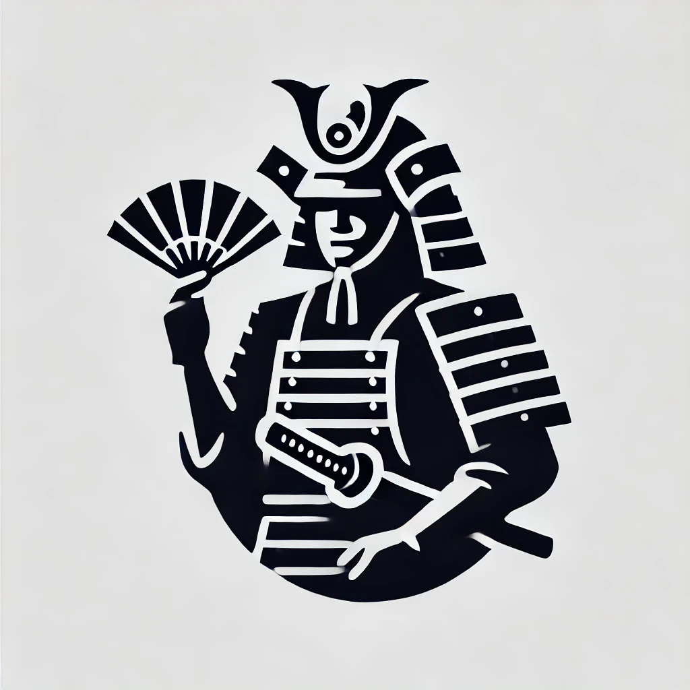

<p align="center">
	
</p>
<h1 align="center">🏯 Gunshi</h1>

[![Version][npm-version-src]][npm-version-href]
[![CI][ci-src]][ci-href]
[![InstallSize][install-size-src]][install-size-src]

<!--
[![JSR][jsr-src]][jsr-href]
-->

Gunshi is a modern javascript command-line library

> [!TIP]
> gunshi (軍師) is a position in ancient Japanese samurai battle in which a amurai devised strategies and gave orders. That name is inspired by the word "command".

## ✨ Features

Gunshi is designed to simplify the creation of modern command-line interfaces:

- 📏 **Simple**: Run the commands with a simple API.
- 🛡️ **Type Safe**: Arguments parsing and options value resolution type-safely by [args-tokens](https://github.com/kazupon/args-tokens)
- ⚙️ **Declarative configuration**: Configure the command modules declaratively.
- 🧩 **Composable**: Sub-commands that can be composed with modularized commands.
- ⏳ **Lazy & Async**: Command modules lazy loading and asynchronously executing.
- 📜 **Auto usage generation**: Automatic usage message generation with modularized commands.
- 🎨 **Custom usage generation**: Usage message generation customizable.
- 🌍 **Internationalization**: I18n out of the box and locale resource lazy loading.

## 💿 Installation

```sh
# npm
npm install --save gunshi

## pnpm
pnpm add gunshi

## yarn
yarn add gunshi

```

## 🙌 Contributing guidelines

If you are interested in contributing to `gunshi`, I highly recommend checking out [the contributing guidelines](/CONTRIBUTING.md) here. You'll find all the relevant information such as [how to make a PR](/CONTRIBUTING.md#pull-request-guidelines), [how to setup development](/CONTRIBUTING.md#development-setup)) etc., there.

## ©️ License

[MIT](http://opensource.org/licenses/MIT)

<!-- Badges -->

[npm-version-src]: https://img.shields.io/npm/v/gunshi?style=flat
[npm-version-href]: https://npmjs.com/package/gunshi
[jsr-src]: https://jsr.io/badges/@kazupon/gunishi
[jsr-href]: https://jsr.io/@kazupon/gunshi
[install-size-src]: https://pkg-size.dev/badge/install/72346
[install-size-href]: https://pkg-size.dev/gunshi
[ci-src]: https://github.com/kazupon/gunshi/actions/workflows/ci.yml/badge.svg
[ci-href]: https://github.com/kazupon/gunshi/actions/workflows/ci.yml
